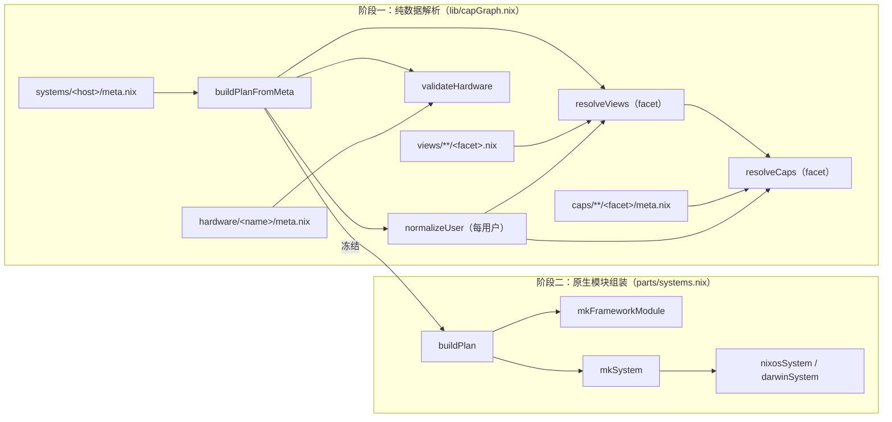
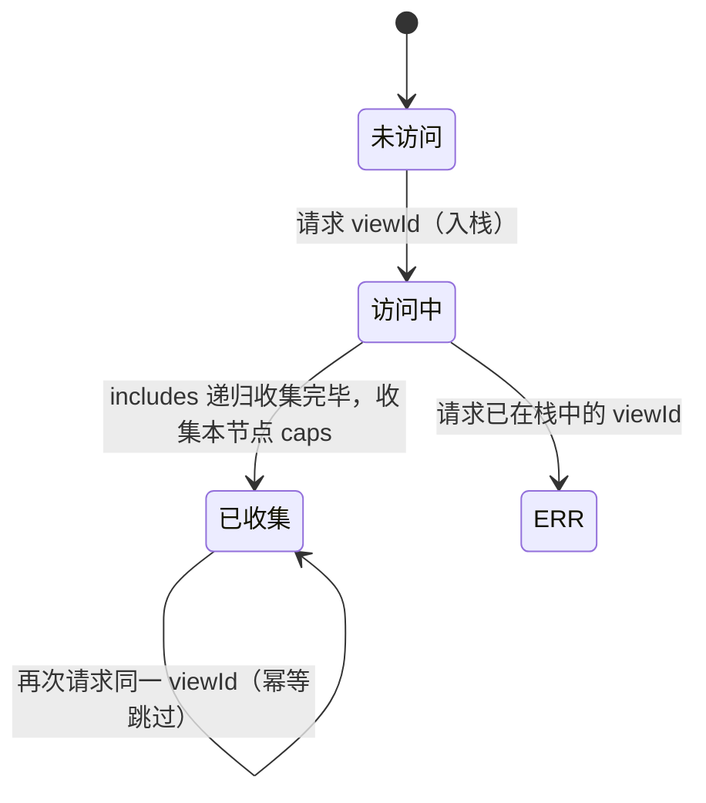
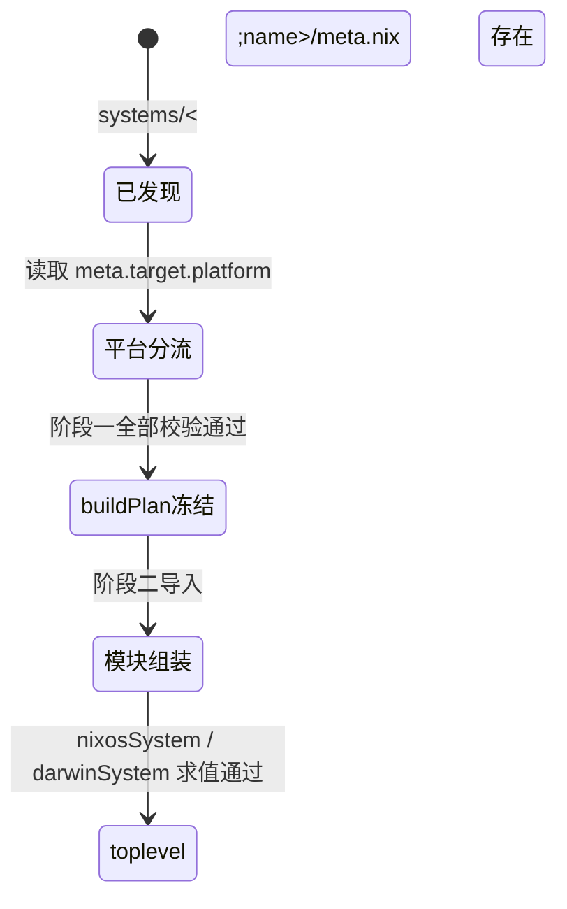

# KaguyaNix 能力图与两阶段构建 — 权威规格（Spec）

**状态:** Authoritative（唯一权威）
**版本:** 1.1（决策基线：D01–D16）
**受众:** 框架开发读全文；cap 与 view 作者读 §2、§4、§5、§7；运维读 §4（REQ-020、REQ-021）与 §10。
**范围:** 规定 KaguyaNix 框架的能力图解析、两阶段构建、目录身份分层、错误模型与验收屏障的行为契约；宿主机业务声明内容与单个 cap 的实现选择不在范围内（见 §1.3）。
**治理:** 行为变更必须先在 §9 决策日志新增或归因决策 ID，同步 `docs/specs/kaguya/tools/audit_manifest.json`，在仓库根目录依次运行 `python3 docs/specs/kaguya/tools/test_audit_spec.py`、`python3 docs/specs/kaguya/tools/audit_spec.py`、`python3 docs/specs/kaguya/tools/barriers.py` 全部 PASS 后再进入 plan 与代码；被取代条款原地合并或删除，不留修订标注；spec 与代码同批提交。
**变更历史:** 见 `history/`、`issues/` 与 §9 决策日志。

---

## 1. 背景与目标

### 1.1 为什么写

- 现状问题：框架行为契约分散于 `README.md`、`AGENTS.md` 两份文档与 `lib/capGraph.nix`、`lib/errors.nix`、`lib/packages.nix`、`parts/systems.nix`、`parts/deploy.nix` 的实现中；文档之间无优先级裁决，行为变更无决策归因，`caps/`、`views/`、`systems/` 下全部节点依赖这些隐式契约。
- 影响：新增复用单元时目录身份判定（叶子能力或聚合视图）无唯一依据；覆写合并顺序、支持表缺省语义、用户禁用语义等实现事实未成文，只能阅读源码获得；`make kaguya upgrade` 向下游仓库复制框架时缺乏可验收的契约基线。

### 1.2 目标

- GOAL-1 能力图与两阶段构建契约收敛为单一权威规格，结构审计与审计器负例自测全绿（AC-001）。
- GOAL-2 全部规范性条款归因决策 ID（D01–D16），并具备代码契约、测试锚点、验收屏障三类机器证据之一（AC-002）。
- GOAL-3 错误模型覆盖第一阶段全部失败路径，异常与边界行为逐条给出可观察结果与锚点（AC-003、AC-004）。
- GOAL-4 验收屏障以 `tests/` 下 12 个脚本为准，全部实跑通过（AC-005）。

### 1.3 非目标（Out of Scope）

- 不规定单个 cap 的 `module.nix` 内部实现（option 设计、软件包选择）。
- 不规定宿主机业务声明内容（某台机器启用哪些 cap 与 view）。
- 不定义 nixpkgs、nix-darwin、home-manager、deploy-rs 的上游行为。
- 不包含实施波次、迁移步骤与推进计划；此类内容归入 `plans/`。
- 不管理 `.worktrees/` 与编辑器、CI 平台配置。

## 2. 术语表

| 术语 | 定义 | 禁止同义词 |
|---|---|---|
| 宿主机（host） | `systems/` 下含 `meta.nix` 的目录所声明的构建目标，目录名即宿主机名 | 机器名、节点 |
| 叶子能力（cap） | `caps/<domain>/<name>/` 下单一职责的原子复用单元，是框架中唯一的复用实现单元；标识为 `<domain>/<name>` | 能力模块、组件 |
| 聚合视图（view） | `views/<domain>/<name>/` 下的纯数据聚合节点，仅声明支持表、`includes`、`caps`，不含任何实现 | 聚合模块、集合 |
| facet | cap 或 view 面向模块图的作用面，取值 `system` 或 `user`；cap 中为同名子目录，view 中为同名 `.nix` 文件 | 侧面、维度 |
| 支持表 | 节点元数据中 `support.platform` 与 `support.arch` 的合称，枚举该节点允许的构建目标 | 平台白名单 |
| 构建目标（target） | 宿主机声明的 `platform` 与 `arch` 二元组，派生 `system` 标识 | 目标三元组 |
| 构建计划（buildPlan） | 阶段一冻结的解析结果属性集，经 `kaguya.buildPlan` option 与 `kaguyaBuildPlan` 参数暴露 | 中间表示、蓝图 |
| 两阶段构建 | 阶段一纯数据解析与阶段二原生模块组装构成的构建模型 | 双阶段、双相 |
| 用户实例 | `systems/<host>/users/<name>/meta.nix` 声明的宿主机内用户数据 | 用户档案 |
| 共享身份默认值 | `systems/shared/users/<name>/default.nix` 提供的跨宿主机用户默认模块 | 身份 cap |
| 硬件配置 | `hardware/<name>/` 目录（`meta.nix` 与 `configuration.nix`） | 硬件模板 |
| 部署目标 | `deploy/<name>.nix` 声明的 deploy-rs 节点 | 部署档案 |
| 错误码 | `lib/errors.nix` 中 `<命名空间>.<标识>` 形式的错误标识符，命名空间为 `node`、`user`、`cap`、`view`、`hardware` 之一 | 错误码别名 |
| 覆写（overrides） | 宿主机或用户实例对 `kaguya.*` option 的最终覆盖数据 | 修订层 |

## 3. 系统模型与状态机

### 3.1 架构与边界



依赖方向：阶段一只读取纯数据 meta 文件；阶段二单向消费冻结的 buildPlan，不回读 meta；cap 的 `module.nix` 只通过 `kaguya.*` option 与 NixOS / Home Manager 模块系统交互。`lib/` 每个文件经 `lib.extend` 注入 extendedLib；其中六个符号经 flake 层公开为 `lib.kaguya`（REQ-018）。extendedLib 另向模块作者暴露 `lib.arch`（`isLinux` / `isDarwin` / `getPlatformType`，架构字符串分类工具，接受任意架构字面量，其 `linuxArchs` 含 `i686-linux`、`riscv64-linux` 等支持表枚举之外的值）与 `lib.packages`；二者不参与支持表校验，构建目标枚举仍以 REQ-008 为准。

本 spec 不负责：上游工具内部行为、cap 实现细节、宿主机业务数据。

### 3.2 状态定义

buildPlan 为冻结属性集，字段与零值规则如下（解析顺序保持请求顺序与依赖后序，不做排序）：

```text
buildPlan :=
  { hostName              : string        # 宿主机名
  , locale                : string        # 错误本地化语言
  , target                : { platform, arch, system }
      # system = "${arch}-linux"（platform=linux）或 "${arch}-darwin"（platform=darwin）
  , hardware              : { name, modulePath, platform, arch }
  , hostOverrides         : attrset       # 宿主机覆写
  , systemCaps            : [capId]       # 系统面解析终态
  , systemCapModulePaths  : [path]        # 与 systemCaps 同序
  , systemOptionDefaults  : [attrset]     # 每项为 setAttrByPath (optionPath ++ ["enable"]) true
  , systemViews           : [viewId]      # 系统面视图收集序
  , users.<name>          : 用户实例终态   # 含 caps、views、modulePaths、optionDefaults、overrides 等规范化字段
  , resolvedUsers         : attrset       # 与 users 同值的别名字段；消费方应读取 users
  }
```

| 缺省输入 | 缺省值 | 缺省语义 |
|---|---|---|
| `meta.locale` | `"zh-CN"` | 错误输出语言 |
| `meta.views` / `meta.caps` / `meta.overrides` / `meta.users` | `[]` / `[]` / `{}` / `{}` | 无对应请求 |
| cap 或 view 的 `support.platform` / `support.arch` | `[]` | 不支持任何构建目标，构建必然报错（§7-E05） |
| cap 的 `optionPath` | `[]`（规范上禁止缺省，见 REQ-003） | 注入路径退化为顶层 `enable`，触发模块系统错误（§7-E06） |
| 用户 `enable` / `admin` | `true` / `false` | 参与构建 / 无管理员映射 |
| 用户 `shell` | `"bash"` | 枚举 bash、fish、zsh（合法值集合见 REQ-009） |
| 用户 `stateVersion` | `"24.05"` | Home Manager 状态版本 |
| 用户 `homeDirectory` | 平台推导 | darwin 为 `/Users/<name>`，linux 为 `/home/<name>` |
| 用户 `extraGroups` / `views` / `caps` / `overrides` | `[]` / `[]` / `[]` / `{}` | 无对应请求 |

### 3.3 状态转换

（a）view 解析状态机（`resolveViews`，每 facet 独立运行）：



| 转换 | 触发 | guard | action | 失败去向 |
|---|---|---|---|---|
| 未访问→访问中 | 宿主机或用户请求 viewId | 标识匹配 `<domain>/<name>`；目录存在；facet 文件存在；支持表包含构建目标 | 入栈，先递归 `includes` | 标识不匹配→`view.invalidId`；目录缺失→`view.unknown`；facet 文件缺失→`view.missingFacet`；平台或架构不支持→`view.unsupportedPlatform` / `view.unsupportedArch` |
| 访问中→已收集 | 全部 includes 收集完毕 | — | 记入 seen；caps 追加本节点 `caps`，经 `lib.unique` 去重后供 cap 解析 | — |
| 访问中→异常 | 请求的 viewId 已在栈中 | — | — | `view.cycle`，消息含完整栈路径 |

（b）cap 解析状态机（`resolveCaps`，每 facet 独立运行）：与（a）同构，差异为：入栈后先递归 `requires`，依赖先于依赖者进入解析结果（后序提交）；支持表校验在加载 facet meta 时执行，失败去向为 `cap.unsupportedPlatform` / `cap.unsupportedArch`；标识不匹配 `<domain>/<name>` 报 `cap.invalidId`（先于目录存在性检查）；目录或 facet 文件缺失分别报 `cap.unknown` / `cap.missingFacet`；栈内重复报 `cap.cycle`。全部节点进入解析终态后，对终态集合逐项校验 `conflicts`：任一被声明的冲突 capId 出现在解析终态中即抛 `cap.conflict`。

（c）宿主机状态机：



平台分流规则：`platform = "linux"` 进入 `nixosConfigurations`，`platform = "darwin"` 进入 `darwinConfigurations`；分流读取本身缺省按 linux 处理，随后阶段一对缺失的 `target.platform` 抛 `node.missingField` 终止（§7-E10）。

（d）用户实例状态：`enable = true` 为参与态（views 与 caps 参与解析、阶段二生成用户模块）；`enable = false` 为旁路态（views 与 caps 的解析输入为空列表，buildPlan.users 中保留该用户但全部集合为空，阶段二不生成任何模块，见 REQ-010 与 §7-E14）。

## 4. 功能需求与接口契约

> 下述各条目均为规范性契约；示例中"期望"指可观察结果。每条注明优先级与决策归因。

- REQ-001 宿主机纯数据声明（P0，D02/D03/D04）
  **作为** 框架使用者，**我希望** 用一份纯数据 `meta.nix` 声明宿主机，**以便** 阶段一不接触原生模块即可完成全部解析。
  契约：`systems/<host>/meta.nix` 只含下述数据字段，不含模块逻辑：

```nix
{
  target.platform = "linux" | "darwin";  # 必填
  target.arch = "x86_64" | "aarch64";    # 必填
  hardware = "<hardware-name>";          # 必填，指向 hardware/<name>/
  locale = "zh-CN";                      # 缺省 zh-CN
  views = [ "<domain>/<name>" ];         # 缺省 []
  caps = [ "<domain>/<name>" ];          # 缺省 []
  overrides = { /* kaguya.* 覆写 */ };   # 缺省 {}
  users.<name> = import ./users/<name>/meta.nix;
}
```

  Given `systems/laptop-asus-tx4-personal/meta.nix` 声明 `platform = "linux"`、`arch = "x86_64"`；When `nix eval .#nixosConfigurations.laptop-asus-tx4-personal.config.kaguya.buildPlan.target`；Then platform 求值为 `linux`、arch 求值为 `x86_64`。Given meta 缺 `target`；When 求值 buildPlan；Then 抛 `node.missingField`（锚点：前者 `tests/framework-smoke.sh`；后者 `tests/error-paths.sh` T13）。

- REQ-002 硬件配置契约（P0，D03/D04）
  **作为** 框架使用者，**我希望** 硬件支持表与硬件模块集中在一个目录，**以便** 平台校验与阶段二导入使用同一事实源。
  契约：`hardware/<name>/` 必须同时含 `meta.nix` 与 `configuration.nix`；`meta.nix` 仅承载支持表（`support.platform`、`support.arch`），不含路径字段；阶段二导入的硬件模块路径固定为该目录下的 `configuration.nix`。缺目录→`hardware.unknown`；缺 `meta.nix`→`hardware.missingMeta`；缺 `configuration.nix`→`hardware.missingConfiguration`；目标不在支持表→`hardware.unsupportedPlatform` / `hardware.unsupportedArch`。
  Given 宿主机声明 `hardware = "mbpM2"` 且构建目标为 darwin/aarch64；When 阶段一校验；Then `hardware` 字段冻结为 `{ name = "mbpM2"; modulePath = <configuration.nix 路径>; … }`（锚点：`tests/framework-smoke.sh` 经 darwin buildPlan 求值间接覆盖）。

- REQ-003 叶子能力布局与 meta 契约（P0，D01/D04/D10）
  **作为** cap 作者，**我希望** 单一职责实现在固定布局下被框架发现，**以便** 支持表、依赖与冲突成为机器可校验数据。
  契约：`caps/<domain>/<name>/<facet>/{meta.nix,module.nix}`，`facet ∈ {system, user}`，同一 cap 允许同时拥有两个 facet，facet 间独立解析。`meta.nix` 必须返回：`optionPath`（非空 `list<string>`，必须显式声明）、`support.platform`（`list<string>`，取值于 {linux, darwin}）、`support.arch`（`list<string>`，取值于 {x86_64, aarch64}）、`requires`（`[capId]`，缺省 `[]`）、`conflicts`（`[capId]`，缺省 `[]`）。`meta.nix` 不得含实现逻辑。`optionPath` 类型非法→`cap.invalidMetaField`；`support.platform` 与 `support.arch` 属于支持表，取值集合与 REQ-008 一致。
  Given `caps/services/docker/system/meta.nix` 声明 `optionPath = ["kaguya" "services" "docker"]`；When 阶段二组装；Then 模块图中存在 `kaguya.services.docker` option 子树（锚点：`tests/framework-smoke.sh` 对 systemCaps 的断言）。

- REQ-004 聚合视图纯数据契约（P0，D01/D04）
  **作为** view 作者，**我希望** 以纯数据组合既有叶子能力，**以便** 聚合层不产生第二套实现语义。
  契约：`views/<domain>/<name>/{system,user}.nix`，两个 facet 文件均可缺省（无该 facet 即不参与该 facet 解析）。每个 facet 文件只返回 `support.platform`、`support.arch`、`includes`（`[viewId]`，缺省 `[]`）、`caps`（`[capId]`，缺省 `[]`）四类字段；禁止出现 `module.nix`、`optionPath` 与任何 option 赋值。字段类型非法→`node.invalidType`。
  Given `views/development/base/system.nix` 声明 `caps = ["development/toolchain" …]`；When Linux 宿主机请求该 view；Then 上述 capId 全部进入系统面解析终态（锚点：`tests/framework-smoke.sh` 对 systemViews 的断言）。

- REQ-005 视图递归展开（P0，D07）
  **作为** 框架使用者，**我希望** `includes` 递归展开且结果幂等，**以便** 视图多层组合不产生重复能力。
  契约：`resolveViews` 以深度优先访问，`includes` 先于本节点收集；同一 viewId 在一次解析中至多收集一次；输出 `views` 为收集完成序（`includes` 先于引用者提交，后序）、`caps` 为收集序经 `lib.unique` 去重。宿主机侧请求序为"视图展开结果在前、显式 `caps` 在后"再整体去重。
  Given 请求 `["a/base"]` 且其声明 `caps = ["x/leaf"]`；When 调用 `resolveViews`；Then 结果 `caps` 含 `"x/leaf"`。Given 请求含互相 include 的 `c1/base` 与 `c2/base`；Then 抛 `view.cycle`（锚点：`tests/view-graph.sh` Test 1 与 Test 3）。Given 请求 `["d/outer"]` 且其 includes `d/inner`；Then `views` 求值为 `["d/inner","d/outer"]`（锚点：`tests/error-paths.sh` T24）。

- REQ-006 能力依赖解析顺序（P0，D07）
  **作为** 框架使用者，**我希望** `requires` 决定导入顺序，**以便** 被依赖能力先于依赖者启用。
  Given 请求 `["b/needs-a"]` 且其 `requires = ["a/leaf"]`；When 阶段一解析；Then `systemCaps`（或用户面 caps）中 `"a/leaf"` 位于 `"b/needs-a"` 之前。Given 请求 `["does/not-exist"]`；Then 输出含 `未知 cap` 的中文错误（锚点：顺序断言 `tests/error-paths.sh` T03；未知 cap `tests/framework-smoke.sh`）。

- REQ-007 冲突检测（P0，D07）
  **作为** 框架使用者，**我希望** 声明冲突的能力组合在第一阶段被拒绝，**以便** 互斥能力不进入构建。
  契约：`conflicts` 校验发生在全部节点进入解析终态之后，对解析终态集合逐项检查：被声明冲突的 capId 出现在解析终态中即抛 `cap.conflict`，消息含声明方与被冲突方。经 `requires` 间接引入的能力同样参与校验。
  Given `a/x` 声明 `conflicts = ["a/y"]` 且解析终态同时含两者；When 阶段一校验；Then 抛 `cap.conflict`（锚点：`tests/error-paths.sh` T01）。

- REQ-008 支持表校验（P0，D04）
  **作为** 框架使用者，**我希望** 节点支持范围显式声明并统一校验，**以便** 平台适配错误在构建前暴露。
  契约：`support.platform` 取值于 {linux, darwin}（`validPlatforms`），`support.arch` 取值于 {x86_64, aarch64}（`validArches`）；cap、view、hardware 三类节点在同一构建目标下统一校验：`target.platform ∉ support.platform` → 对应 `*.unsupportedPlatform`；`target.arch ∉ support.arch` → 对应 `*.unsupportedArch`。校验失败终止解析，不剔除节点。
  Given view `p/base` 仅声明 `support.platform = ["darwin"]`；When 以 linux 目标请求；Then 抛 `view.unsupportedPlatform`（锚点：`tests/view-graph.sh` Test 4）。

- REQ-009 用户实例规范化（P0，D06）
  **作为** 宿主机管理者，**我希望** 用户实例字段经统一规范化与缺省填充，**以便** 阶段二消费确定形态。
  契约：`normalizeUser` 输出字段固定为 `enable`（bool，缺省 `true`）、`admin`（bool，缺省 `false`）、`shell`（枚举 bash、fish、zsh，缺省 `bash`；非法值抛 `node.invalidEnum`）、`extraGroups`（`[string]`，缺省 `[]`）、`caps`（`[capId]`，缺省 `[]`）、`views`（`[viewId]`，缺省 `[]`）、`overrides`（attrset，缺省 `{}`）、`stateVersion`（string，缺省 `"24.05"`）、`homeDirectory`（string，缺省按平台推导：darwin 为 `/Users/<name>`，linux 为 `/home/<name>`）。类型非法抛 `node.invalidType`。
  Given 用户实例声明 `shell = "fish"`；When 阶段一规范化；Then `stateVersion` 为 `"24.05"` 且 `homeDirectory` 为平台推导值（锚点：缺省值断言 `tests/error-paths.sh` T19、T20；caps 终态 `tests/software-capabilities.sh`）。

- REQ-010 用户禁用语义（P0，D11）
  **作为** 宿主机管理者，**我希望** `enable = false` 的用户完全旁路，**以便** 临时下线用户不残留模块。
  契约：`enable = false` 时该用户 views 与 caps 的解析输入为空列表，buildPlan.users 保留该用户且 `caps`、`views`、`modulePaths`、`optionDefaults` 均为空集合；阶段二的 `enabledUsers` 过滤排除该用户，不生成 home-manager 用户模块、不生成 `users.users` 条目、不影响 `environment.shells` 与 `programs.fish.enable`。
  Given 用户实例声明 `enable = false` 且 views 非空；When 阶段一解析；Then 该用户解析终态 caps 为空；When 阶段二组装；Then 模块图中无该用户的 home-manager 模块（锚点：解析旁路 `tests/error-paths.sh` T18；布局入口 `tests/host-user-layout.sh`）。

- REQ-011 构建计划冻结与暴露（P0，D02/D09）
  **作为** 框架开发者，**我希望** 阶段一结果以两种通道暴露，**以便** 模块与外部工具消费同一冻结事实。
  契约：buildPlan 在阶段二开始前冻结（阶段二不回读 meta）；暴露通道一为内部 option `kaguya.buildPlan`（`types.attrs`、internal、readOnly）；通道二为 `specialArgs.kaguyaBuildPlan` 与 `home-manager.extraSpecialArgs.kaguyaBuildPlan`。
  Given 任一已配置宿主机；When `nix eval .#<set>.config.kaguya.buildPlan.target.platform`；Then 求值成功且与 meta 声明一致（锚点：`tests/framework-smoke.sh`）。

- REQ-012 启用注入与覆写合并（P0，D10）
  **作为** cap 作者，**我希望** 能力启用由框架统一注入、宿主机覆写最后生效，**以便** 模块只关心 `mkIf cfg.enable`。
  契约：每个解析成功的 facet 产生注入项 `setAttrByPath (optionPath ++ ["enable"]) true`；注入项与覆写经 `mergeAttrsets`（`lib.recursiveUpdate` 折叠）合并，同路径叶子值后写胜出。系统面合并序为 `systemOptionDefaults → hostOverrides → { kaguya.buildPlan = plan; }`，即 buildPlan 注入优先级最高；用户面合并序为 `optionDefaults → 用户 overrides`。
  Given 宿主机 `overrides` 声明 `kaguya.services.docker.storageDriver = "btrfs"` 且 docker cap 已启用；When 阶段二求值；Then `kaguya.services.docker.enable` 为 `true` 且存储驱动为 `"btrfs"`（锚点：`tests/framework-smoke.sh` 对 buildPlan 的求值覆盖注入路径）。

- REQ-013 阶段二模块组装顺序（P0，D08）
  **作为** 框架开发者，**我希望** 模块导入顺序确定，**以便** 覆写与平台模块行为可预测。
  契约：`modules` 列表按序为：nixpkgs overlay 注入（`packages.overlay`）、`packages.module`、平台基础（`nixpkgs.config.allowUnfree = true`、`nixpkgs.hostPlatform = target.system`）、框架模块（`mkFrameworkModule`）、`hardware/<name>/configuration.nix`、平台模块（linux：nix-flatpak、home-manager；darwin：home-manager）、`systemCapModulePaths`（解析序）、`systems/<host>/default.nix`（存在时）、`parts/patch` 返回的 `getModules`。构建参数追加 `patches.getBuildArgs`。`systems/<host>/default.nix` 为转义通道，不参与能力图解析。
  Given 宿主机含 9 个显式系统 cap 与视图展开结果；When `make check` 求值；Then 上述顺序逐一导入且评估通过（锚点：`tests/makefile-smoke.sh` 对 check 入口的断言 + 全套 nix eval 屏障）。

- REQ-014 平台分流与 builder 选择（P0，D08）
  **作为** 框架使用者，**我希望** 平台声明决定 builder 与 nixpkgs 通道，**以便** linux 与 darwin 宿主机共存于一个 flake。
  契约：`platform = "darwin"` 使用 `nix-darwin` 的 `darwinSystem`、nixpkgs 输入 `nixpkgs-darwin`（flake 中独立锁定的通道），平台模块 home-manager（darwinModules）；`platform = "linux"` 使用 `nixosSystem`、nixpkgs 输入 `nixpkgs`、平台模块 nix-flatpak 与 home-manager（nixosModules）。unstable 通道取 `nixpkgs-unstable`（缺省回退到对应平台输入），以 `target.system` 求值且 `allowUnfree = true`。`specialArgs` 固定注入 `inputs`、`unstable`、`lib = extendedLib`、`hostName`、`kaguyaBuildPlan`。Darwin 宿主机的包通道为 `nixpkgs-darwin`，与 linux 宿主机使用的 `nixpkgs` 输入互不影响。
  Given `laptop-mbpM2` 声明 darwin/aarch64；When flake 求值；Then 该宿主机仅出现在 `darwinConfigurations`（锚点：`tests/framework-smoke.sh` darwin 断言）。

- REQ-015 home-manager 接线与共享身份导入（P0，D08/D03）
  **作为** 宿主机管理者，**我希望** 用户模块由框架统一接线，**以便** 用户能力与身份默认值自动生效。
  契约：框架模块设置 `home-manager.useGlobalPkgs = true`、`home-manager.useUserPackages = true`；每个参与态用户的模块导入序为：用户面 `modulePaths`、`systems/shared/users/<name>/default.nix`（存在时，经 `lib.optional` 跳过缺失）、用户配置注入（`home.username`、`home.homeDirectory`、`home.stateVersion`、`programs.home-manager.enable = true` 与 REQ-012 合并结果）。共享身份默认值不建模为 cap。
  Given `systems/shared/users/rikki/default.nix` 存在；When 阶段二组装任一含 rikki 的宿主机；Then 该文件进入 rikki 的 home-manager 模块导入列表（锚点：`tests/migration-equivalence.sh` 身份数据断言 + `tests/identity-placement.sh`）。

- REQ-016 系统用户与 shell 生成（P1，D06/D08）
  **作为** 宿主机管理者，**我希望** 系统账户由用户实例派生，**以便** 账户属性单一事实源。
  契约：每个参与态用户生成 `users.users.<name>`：linux 为 `{ isNormalUser = true; home; extraGroups = (admin ? ["wheel"] : []) ++ extraGroups; shell; }`；darwin 为 `{ name; home; shell; }`（无组与管理员映射）。shell 包映射：fish→`pkgs.fish`、zsh→`pkgs.zsh`、bash→`pkgs.bashInteractive`。全部用户 shell 包注入 `environment.shells`（去重）；存在 fish 用户时 `programs.fish.enable = true`。
  Given rikki 声明 `admin = true`、`shell = "fish"` 且 linux 宿主机；When 阶段二求值；Then rikki 的 extraGroups 含 `wheel`、`environment.shells` 含 fish（锚点：`tests/migration-equivalence.sh` 组断言；账户细节人工对照）。

- REQ-017 错误模型与本地化（P0，D05）
  **作为** 框架使用者，**我希望** 全部校验失败输出确定、本地化的错误，**以便** 无需阅读源码即可定位问题。
  契约：第一阶段全部失败经 `throwError` 抛出；渲染语言取宿主机 `locale`，bundle 缺失时回退 `zh-CN`；错误码无渲染器时经 `fallbackRenderer` 输出 JSON 形态。错误码全集与产生条件见 §5。
  Given 宿主机 `locale = "zh-CN"` 且 cap 不存在；When 阶段一解析；Then 输出含 `未知 cap` 的中文消息（锚点：`tests/framework-smoke.sh`、`tests/view-graph.sh`）。

- REQ-018 flake 公开接口（P0，D09）
  **作为** 外部工具开发者，**我希望** 框架核心函数经 flake lib 稳定暴露，**以便** 不依赖内部路径即可复用解析器。
  契约：`flake.lib.kaguya` 导出 `buildPlanFromMeta`、`mergeAttrsets`、`resolveViews`、`defaultLocale`、`renderError`、`throwError` 六个符号；`buildPlanFromMeta` 以 `{ hostName, meta, capsDir, hardwareDir, viewsDir }` 为参，返回 §3.2 形态的 buildPlan。宿主机集合自动发现：`systems/` 下含 `meta.nix` 的目录，按平台分流进 `nixosConfigurations` 与 `darwinConfigurations`。
  Given `nix eval --impure --expr` 直接调用 `flake.outputs.lib.kaguya.resolveViews`；Then 返回视图展开结果（锚点：`tests/view-graph.sh` 全部用例）。

- REQ-019 自定义包扫描（P1，D13）
  **作为** 包作者，**我希望** `packages/` 目录条目自动成为 overlay 与模块，**以便** 无需手工注册。
  契约：`packages/` 下每个条目（目录或 `.nix` 文件）以去后缀名为包名；overlay 求值其 `package` 属性，缺失时抛出含 `must export 'package' attribute` 的错误，即包定义必须导出 `package` 属性；模块侧收集各包 `options` 与 `config`：`config` 经 `mkMerge` 合并，`options` 以属性集折叠合并（同名 option 声明由后写包覆盖先写包，不触发模块系统冲突报错）。overlay 注入全部宿主机（REQ-013 第一项）。
  Given `packages/` 下存在导出 `package` 属性的条目；When flake 求值；Then 该条目名在 `pkgs` 中可用（锚点：`lib/packages.nix` 的 overlay 生成契约；`packages/` 当前不存在，扫描守卫将其视为空集，无运行时条目）。

- REQ-020 部署目标生成（P1，D12）
  **作为** 运维，**我希望** `deploy/` 下声明式生成 deploy-rs 节点，**以便** 远程部署与本地构建同源。
  契约：`deploy/<name>.nix` 必填 `hostname` 与 `system`（指向 `nixosConfigurations.<system>`）；缺省 `sshUser = "root"`、`fastConnection = true`、`autoRollback = true`、`magicRollback = true`、`sshOpts = []`。激活库按 `builtins.currentSystem` 选择，禁止硬编码单一架构。每系统挂 deploy-rs `deployChecks`。
  Given `deploy/<name>.nix` 声明合法；When flake 求值 `deploy.nodes`；Then 生成含上述缺省的节点（锚点：`tests/deploy-smoke.sh`）。

- REQ-021 Makefile 入口（P2，D14）
  **作为** 使用者，**我希望** `make` 目标封装常用操作，**以便** 不记忆底层命令。
  契约：`make list` 列出全部自动发现的宿主机；`make use <host>` 依 `darwinConfigurations` / `nixosConfigurations` 归属选择 darwin（`nix run nix-darwin -- switch`）或 NixOS（`nixos-rebuild switch`）切换入口，两者均携带 `--show-trace` 与 path flake 引用；`make check [host]` 对目标执行 `nix build --dry-run`；`make <host>` 直达 `make use TARGET_SYSTEM=<host>`。其余入口为确定性薄封装：`make update [input]` 执行 `nix flake update`（带参时仅更新指定 input）；`make format` 执行 `alejandra ./`；`make clean-garbage` 执行 `nix-collect-garbage -d`；`make eval-time <host>` 对目标执行 `nix build --dry-run`（darwin）或 `nix eval toplevel`（linux）并计时；`make deploy-list` 列出 `deploy/` 下全部部署目标及 hostname；`make deploy <name>` 经 `nix run github:serokell/deploy-rs -- path:./#<name>` 执行部署。
  Given 执行 `make -n use laptop-mbpM2`；When 输出计划；Then 含 `nix run nix-darwin -- switch --flake path:./#...` 且不含裸 `darwin-rebuild`（锚点：`tests/makefile-smoke.sh`）。

- REQ-023 框架升级工具（P2，D16）
  **作为** 框架维护者，**我希望** 将框架代码同步到下游仓库并保留用户数据，**以便** 下游仓库复用框架演进。
  契约：`make kaguya upgrade <path>` 前置校验三项：目标路径存在、目标为 git 仓库、目标 `git status --short` 输出为空；任一不满足即非零退出并输出修复指引。通过校验后交互确认（读入单字符，仅 Y/y 继续，其余取消退出）。执行语义：清理与复制两阶段均以 `*` 通配遍历，点文件（含 `.git`、`.gitignore`）不被通配匹配，`.git` 与目标 `.gitignore` 因此不被删除；目标仓库中保留 `*.md`、`*.lock`、`*.code-workspace`、`users/`、`systems/`、`packages/`、`modules/`、`hardware/`、`deploy/` 及全部点文件，其余可见条目删除；复制阶段从源仓库复制除保留集合外的全部可见条目，随后在源仓库存在 `.gitignore` 时以源版本覆盖目标 `.gitignore`（下游自定义的 `.gitignore` 不被保留）。`systems/`、`packages/`、`modules/`、`hardware/`、`deploy/` 五目录先备份至 `/tmp/kaguya_upgrade_backup_<时间戳>`，清理复制完成后从备份恢复。结束输出目标仓库 `git status` 摘要（至多 30 行）与备份位置。
  Given 目标仓库存在未提交更改；When 执行升级；Then 非零退出并列出未提交文件清单（锚点：人工对照；无自动化锚点）。

- REQ-022 目录身份治理（P0，D03）
  **作为** 框架维护者，**我希望** 每类内容只有唯一合法落位，**以便** 目录结构本身承载身份判定。
  契约：`caps/` 只承载叶子能力，禁止聚合入口与用户身份模块；`views/` 只承载聚合视图；base、workstation 这类聚合名称只允许出现在 `views/` 层；宿主机局部补充写 `systems/<host>/default.nix`，用户宿主机局部补充写 `systems/<host>/users/<name>/default.nix`，跨宿主机身份默认值写 `systems/shared/users/<name>/default.nix`；系统命名采用 `{设备类型}-{硬件型号}-{用途}`。`caps/` 下禁止 `common`、`base` 命名的聚合目录。
  Given `caps/` 目录树；When 运行叶子审计；Then 无 `common` / `base` 聚合目录与已删除聚合残留（锚点：`tests/module-leaf-audit.sh`、`tests/identity-placement.sh`、`tests/cleanup-check.sh`）。

## 5. 错误模型

错误身份：Nix 评估无 `errors.Is` 类机制；第一阶段错误的身份即错误码字符串加上消息内的定位字段（subject、facet、expected、actual、cycle、conflicting 等），消费方为 `nix eval` / `make check` / `make use` 的 stderr。全部错误码定义于 `lib/errors.nix`（zh-CN 与 en-US 双 bundle），抛出点位于 `lib/capGraph.nix` 与 `lib/packages.nix`。

平台与架构不支持规则在三个命名空间平行展开：`cap.unsupportedPlatform`、`view.unsupportedPlatform`、`hardware.unsupportedPlatform` 仅命名空间与节点类型不同，判定与消息字段完全同构，`cap.unsupportedPlatform` 的期望值即该 facet 声明的 `support.platform` 列表。

| 标识符 | 定义位置 | 产生条件 | 消息定位字段 | 消费方 |
|---|---|---|---|---|
| `node.missingField` | lib/errors.nix | meta 缺 `target`、`target.platform`、`target.arch` 或 `hardware` | host、subject | 阶段一调用方 |
| `node.invalidType` | lib/errors.nix | 任一 meta 字段类型与期望不符（含 view 字段类型错误） | host、subject、expected、actual | 阶段一调用方 |
| `node.invalidEnum` | lib/errors.nix | `target.platform`、`target.arch` 或用户 `shell` 不在枚举内 | host、subject、expected、actual | 阶段一调用方 |
| `cap.invalidId` | lib/errors.nix | capId 不匹配 `<domain>/<name>` | subject | 阶段一调用方 |
| `cap.unknown` | lib/errors.nix | cap 目录不存在 | subject | 阶段一调用方（`tests/framework-smoke.sh` 断言中文消息） |
| `cap.missingFacet` | lib/errors.nix | facet 目录缺 `meta.nix` 或 `module.nix` | subject、facet | 阶段一调用方 |
| `cap.invalidMetaField` | lib/errors.nix | `optionPath` 非 `list<string>` | subject、facet、field | cap 作者 |
| `cap.unsupportedPlatform` | lib/errors.nix | `target.platform` 不在 `support.platform` | subject、facet、expected、actual | 阶段一调用方 |
| `cap.unsupportedArch` | lib/errors.nix | `target.arch` 不在 `support.arch` | subject、facet、expected、actual | 阶段一调用方 |
| `cap.conflict` | lib/errors.nix | 解析终态同时含声明冲突的双方 | subject、conflicting | 阶段一调用方 |
| `cap.cycle` | lib/errors.nix | `requires` 链出现栈内重复 | cycle（完整路径） | 阶段一调用方 |
| `view.invalidId` | lib/errors.nix | viewId 不匹配 `<domain>/<name>` | subject | 阶段一调用方 |
| `view.unknown` | lib/errors.nix | view 目录不存在 | subject | 阶段一调用方（`tests/view-graph.sh` Test 2） |
| `view.missingFacet` | lib/errors.nix | facet 文件 `<facet>.nix` 缺失 | subject、facet | 阶段一调用方 |
| `view.unsupportedPlatform` | lib/errors.nix | 构建目标平台不在视图支持表 | subject、facet、expected、actual | 阶段一调用方（`tests/view-graph.sh` Test 4） |
| `view.unsupportedArch` | lib/errors.nix | 构建目标架构不在视图支持表 | subject、facet、expected、actual | 阶段一调用方 |
| `view.cycle` | lib/errors.nix | `includes` 链出现栈内重复 | cycle（完整路径） | 阶段一调用方（`tests/view-graph.sh` Test 3） |
| `hardware.unknown` | lib/errors.nix | 硬件目录不存在 | subject | 阶段一调用方 |
| `hardware.missingMeta` | lib/errors.nix | 硬件缺 `meta.nix` | subject | 阶段一调用方 |
| `hardware.missingConfiguration` | lib/errors.nix | 硬件缺 `configuration.nix` | subject | 阶段一调用方 |
| `hardware.unsupportedPlatform` | lib/errors.nix | 构建目标平台不在硬件支持表 | subject、expected、actual | 阶段一调用方 |
| `hardware.unsupportedArch` | lib/errors.nix | 构建目标架构不在硬件支持表 | subject、expected、actual | 阶段一调用方 |
| 包导出错误（Nix 内建 throw） | lib/packages.nix | 包定义未导出 `package` 属性，消息含 `must export 'package' attribute` | 包名 | 包作者 |
| `user.invalidShell`（保留） | lib/errors.nix | 已定义渲染器；当前触发路径由 `node.invalidEnum` 承担，见 `issues/2026-09-08-未接线错误码.md` | user、expected、actual | 预留 |
| `view.invalidField`（保留） | lib/errors.nix | 已定义渲染器；当前无触发点，见同上 issue | subject、field | 预留 |

未知错误码（含未来新增未配渲染器）经 `fallbackRenderer` 输出 `Kaguya error <code>: <JSON>`。

## 6. 非功能需求（NFR）

- 性能（归因 D07）：单次 buildPlan 构建中每个 cap 或 view 的 facet 文件至多 import 一次（seen 去重）；view 展开输出的 caps 经一次 `lib.unique` 去重后进入 cap 解析。解析复杂度为请求节点数与 `requires` / `includes` 边数之和的线性量级（深度优先遍历，每边至多访问一次）。
- 可用性（归因 D02/D05）：第一阶段校验失败一律终止评估并输出本地化错误，禁止静默剔除节点或降级继续；同一 meta 输入在相同 flake 状态下求值结果逐字节一致（纯函数，无副作用、不读环境）。
- 安全（归因 D08/D12）：部署缺省 `sshUser = "root"`、`autoRollback = true`、`magicRollback = true`；`nixpkgs.config.allowUnfree = true` 与 unstable 通道的 `allowUnfree = true` 由框架统一注入，cap 与宿主机不得重复声明；本 spec 不引入密钥、凭据类数据，敏感值不属于任何 meta 字段。
- 合规与保留（归因 D15）：框架不产生运行时数据保留；行为变更历史由 git 提交、`history/` 冻结快照与 §9 决策日志共同承担，快照提交后不修改。
- 容量与背压（归因 D07）：本框架为求值期纯函数管线，无运行时队列与背压面；`includes` / `requires` 链深度无显式上限，深度受 Nix 求值器栈约束，循环依赖由栈检测在求值期内终止（§7-E17）。

## 7. 异常与边界条件


归因：E01 至 E13 的错误行为归 D05 及各自对应 REQ；E05 归 D04；E14 归 D11；E15、E16 归 D08；E17 归 D07；E18 归 D12；E19 归 D14。

| 编号 | 场景 | 前置条件 | 系统行为 | 可观察结果 | 测试锚点 |
|---|---|---|---|---|---|
| E01 | 未知 cap | meta 引用不存在的 capId | `cap.unknown` 终止 | 中文错误含 `未知 cap` | `tests/framework-smoke.sh` |
| E02 | cap facet 残缺 | 目录存在但缺 meta 或 module | `cap.missingFacet` 终止 | 错误含 facet 名 | `tests/error-paths.sh` T04 |
| E03 | meta 字段类型错误 | 任意 meta 字段类型不符 | `node.invalidType` 终止 | 错误含期望与实际类型 | `tests/error-paths.sh` T14 |
| E04 | optionPath 类型非法 | `optionPath` 非 `list<string>` | `cap.invalidMetaField` 终止 | 错误含 field=optionPath | `tests/error-paths.sh` T05 |
| E05 | 支持表缺省 | cap/view/hardware 未声明 `support.platform` 或 `support.arch` | 缺省为空列表，即不支持任何构建目标，校验必然失败 | `*.unsupportedPlatform` 或 `*.unsupportedArch` | `tests/error-paths.sh` T07 |
| E06 | optionPath 缺省 | cap meta 未声明 `optionPath` | 注入退化为顶层 `enable = true`，阶段二模块系统报 option 不存在 | NixOS 模块系统 undefined option 错误 | 人工对照；规范以 REQ-003 禁止缺省 |
| E07 | requires 循环 | 依赖链回到栈内节点 | `cap.cycle` 终止 | 错误含完整环路径 | `tests/error-paths.sh` T02；view 同构路径 `tests/view-graph.sh` Test 3 |
| E08 | conflicts 命中 | 解析终态含冲突双方 | `cap.conflict` 终止 | 错误含声明方与被冲突方 | `tests/error-paths.sh` T01 |
| E09 | 硬件残缺 | 硬件缺目录/meta/configuration | `hardware.unknown` / `hardware.missingMeta` / `hardware.missingConfiguration` | 错误含硬件名 | `tests/error-paths.sh` T10 至 T12 |
| E10 | meta 必填字段缺失 | 缺 `target`、platform、arch 或 hardware | `node.missingField` 终止（平台分流读取阶段缺省按 linux，随后被本错误终止） | 错误含字段名 | `tests/error-paths.sh` T13 |
| E11 | locale 未注册 | meta 声明未知 locale | 回退 `zh-CN` bundle 渲染 | 错误仍为中文 | `tests/error-paths.sh` T25 |
| E12 | 错误码未注册渲染器 | 新增错误码未配 bundle | `fallbackRenderer` 输出 JSON 形态 | `Kaguya error <code>: ...` | `tests/error-paths.sh` T26 |
| E13 | shell 非法 | 用户 shell 不在枚举 | `node.invalidEnum`（保留码 `user.invalidShell` 未接线，见 issues/） | 错误含期望枚举 | `tests/error-paths.sh` T15 |
| E14 | 用户旁路 | 用户实例 `enable = false` | 解析输入为空列表、阶段二不生成模块；属规定行为非错误 | buildPlan.users 中该用户集合为空 | `tests/error-paths.sh` T18 |
| E15 | 共享身份文件缺失 | `systems/shared/users/<name>/default.nix` 不存在 | `lib.optional` 跳过导入，不报错 | 无该导入项 | 人工对照 REQ-015 |
| E16 | 宿主机 default.nix 缺失 | `systems/<host>/default.nix` 不存在 | 跳过导入，不报错 | 无该导入项 | 人工对照 REQ-013 |
| E17 | 深层 include 链 | 视图嵌套深度极大 | 无显式深度上限，受 Nix 求值器栈约束；环由栈检测终止 | 求值完成或求值器栈错误 | 人工对照 §6 |
| E18 | 部署字段缺省 | deploy 声明缺可选字段 | 按 REQ-020 缺省值补齐 | 节点含缺省值 | `tests/deploy-smoke.sh` |
| E19 | Darwin /etc 漂移 | 宿主机 /etc 文件与声明哈希不一致 | nix-darwin 按声明管理，哈希屏障校验声明完整性 | `knownSha256Hashes` 含声明哈希 | `tests/darwin-etc-compat.sh` |

## 8. 验收标准

- AC-001 结构审计通过：`python3 docs/specs/kaguya/tools/test_audit_spec.py` 与 `python3 docs/specs/kaguya/tools/audit_spec.py`（均在仓库根目录执行）退出码为 0，映射 GOAL-1（REQ 全集）。
- AC-002 决策与证据归因：manifest 声明的 D01–D16 全部在 §9 有行，全部代码契约在 `repo_root` 内命中、旧契约零命中，映射 GOAL-2（REQ 全集）。
- AC-003 错误模型完整：§5 表覆盖 `lib/errors.nix` 全部已注册错误码，每个错误码含产生条件与定位字段，映射 GOAL-3（REQ-017）。
- AC-004 异常路径可观察：§7 每行给出系统行为与可观察结果，自动化锚点与人工对照范围分离标注，映射 GOAL-3（REQ-005 至 REQ-008）。
- AC-005 屏障全绿：在仓库根目录执行 `python3 docs/specs/kaguya/tools/barriers.py`，依次执行 `tests/framework-smoke.sh` 等 12 个脚本全部退出码 0，映射 GOAL-4（D14 全集）。
- AC-006 公开接口稳定：`tests/view-graph.sh` 直接驱动 `lib.kaguya.resolveViews` 的 4 个用例全绿，映射 REQ-018。

## 9. 决策日志

| ID | 已确认决策 | 主要影响章节 | 验证规则 |
|---|---|---|---|
| D01 | 复用分两层：叶子能力（cap）是唯一复用实现单元，聚合视图（view）是纯数据聚合、不含实现 | §2、§4（REQ-003、REQ-004） | 审计器 D01 术语与出现次数规则；`tests/module-leaf-audit.sh` |
| D02 | 两阶段构建：阶段一纯数据解析并冻结 buildPlan，阶段二单向消费 buildPlan 组装原生模块 | §3、§4（REQ-011、REQ-013） | 审计器 D02 规则；`tests/framework-smoke.sh` |
| D03 | 目录身份分层：caps/ 只放叶子、views/ 只放聚合、身份默认值入 systems/shared/users、宿主机局部补充入各自 default.nix；聚合名称只允许出现在 views/ 层 | §2、§4（REQ-022） | 审计器 D03 废弃术语零命中；`tests/cleanup-check.sh`、`tests/identity-placement.sh` |
| D04 | 支持表显式声明：platform 枚举 {linux, darwin}、arch 枚举 {x86_64, aarch64}，cap/view/hardware 统一校验，缺省即全不支持 | §3.2、§4（REQ-008） | 审计器 D04 规则；`lib/capGraph.nix` validPlatforms/validArches 契约 |
| D05 | 错误模型：错误码双语言 bundle（zh-CN 缺省、en-US）、locale 回退、fallbackRenderer 兜底 | §5、§4（REQ-017） | 审计器 D05 规则；`tests/framework-smoke.sh`、`tests/view-graph.sh` 中文断言 |
| D06 | 用户实例模型：九字段规范化与缺省值（enable=true、admin=false、shell=bash、stateVersion=24.05、homeDirectory 平台推导） | §3.2、§4（REQ-009、REQ-016） | 审计器 D06 规则；`lib/capGraph.nix` "24.05" 契约 |
| D07 | 图解析语义：includes/requires 深度优先、依赖先于依赖者提交、结果去重幂等、栈检测循环、conflicts 对解析终态校验 | §3.3、§4（REQ-005 至 REQ-007） | 审计器 D07 规则；`tests/view-graph.sh`（展开/循环/平台；cap 冲突路径人工对照） |
| D08 | 阶段二组装与平台分流：固定模块顺序、darwin 走 nix-darwin 与 nixpkgs-darwin、linux 走 nixosSystem 与 nix-flatpak、home-manager 全局 pkgs、specialArgs 注入 | §4（REQ-013 至 REQ-015） | 审计器 D08 规则；`parts/systems.nix` 契约集 |
| D09 | flake 公开接口：lib.kaguya 六符号导出，宿主机自动发现并按平台分流进 nixosConfigurations / darwinConfigurations | §4（REQ-018） | 审计器 D09 规则；`tests/view-graph.sh` 直接驱动公开接口 |
| D10 | 启用注入与覆写合并：optionPath 注入 enable=true，recursiveUpdate 折叠、后写胜出，buildPlan 注入优先级最高 | §4（REQ-012） | 审计器 D10 规则；`lib/capGraph.nix` setAttrByPath 契约 |
| D11 | 用户禁用语义：enable = false 解析输入为空、不生成任何模块 | §3.3、§4（REQ-010）、§7（E14） | 审计器 D11 规则 |
| D12 | 部署模型：deploy/*.nix 生成 deploy-rs 节点，激活库按 builtins.currentSystem 选择，回滚缺省全开 | §4（REQ-020） | 审计器 D12 规则；`tests/deploy-smoke.sh` |
| D13 | 包扫描模型：packages/ 目录自动 overlay 与模块，包定义必须导出 package 属性 | §4（REQ-019）、§5 | 审计器 D13 规则；`lib/packages.nix` 契约 |
| D14 | 验证屏障：tests/ 下 12 个脚本构成验收屏障，AGENTS.md 列出的 9 个为最低集 | §8、§10 | 审计器 D14 规则；`python3 docs/specs/kaguya/tools/barriers.py` |
| D15 | 治理：行为变更决策先行、被取代条款原地合并或删除、问题登记入 issues/、快照冻结不改 | 头部治理、§9、`issues/`、`history/` | 审计器 D15 规则与 forbidden_patterns |
| D16 | Makefile 入口全集与框架升级工具：update/format/clean-garbage/eval-time/deploy-list/deploy 为确定性薄封装；kaguya upgrade 的保留/删除/备份/确认语义契约化 | §4（REQ-021、REQ-023） | 审计器 D16 规则；`tests/makefile-smoke.sh`（入口子集） |

## 10. 验证

- 结构审计：在仓库根目录执行 `python3 docs/specs/kaguya/tools/test_audit_spec.py && python3 docs/specs/kaguya/tools/audit_spec.py`
- 验收屏障：在仓库根目录执行 `python3 docs/specs/kaguya/tools/barriers.py`（依次执行下表 12 个脚本）
- 测试锚点清单（bash 断言型，与 manifest 的 `code_contracts` 中 `tests/*.sh` 条目一一对应；本仓库无 Python 函数锚点，故 manifest `test_anchors` 为空集）：

| 屏障脚本 | 覆盖契约 | 对应条目 |
|---|---|---|
| `tests/framework-smoke.sh` | REQ-001、REQ-011、REQ-014、REQ-017；E01 | AC-005、AC-006 |
| `tests/error-paths.sh` | REQ-001（错误路径）、REQ-005（后序）、REQ-006（顺序）、REQ-007、REQ-009（缺省值）、REQ-010（旁路）、REQ-012（合并）、REQ-018；E02 至 E05、E07 至 E14 | AC-005 |
| `tests/view-graph.sh` | REQ-005、REQ-008、REQ-018；E07 | AC-006 |
| `tests/software-capabilities.sh` | REQ-009、REQ-019 | AC-005 |
| `tests/darwin-etc-compat.sh` | E19 | AC-005 |
| `tests/host-user-layout.sh` | REQ-001、REQ-010 布局入口 | AC-005 |
| `tests/migration-equivalence.sh` | REQ-015、REQ-016 | AC-005 |
| `tests/cleanup-check.sh` | REQ-022 | AC-005 |
| `tests/module-leaf-audit.sh` | REQ-022、D01 | AC-005 |
| `tests/identity-placement.sh` | REQ-015、REQ-022 | AC-005 |
| `tests/makefile-smoke.sh` | REQ-021、REQ-013 入口 | AC-005 |
| `tests/deploy-smoke.sh` | REQ-020；E18 | AC-005 |

- 兼容/迁移屏障表：

| 条件 | 满足标准 | 验收证据 |
|---|---|---|
| 旧注入通道符号 | 代码目录零命中 | `audit_spec.py` obsolete_code_contracts |
| 旧聚合 cap（software/common 等） | caps/views/systems 零命中 | 同上 |
| 身份建模回流（identity 形式） | caps 目录无 identity、共享身份文件在位 | `tests/identity-placement.sh` |
| Darwin /etc 声明完整性 | 三类 shell 配置哈希在 knownSha256Hashes | `tests/darwin-etc-compat.sh` |

- 2026-09-13 基线证据（仓库根目录实跑复验）：`python3 docs/specs/kaguya/tools/test_audit_spec.py`（13 用例全绿）、`python3 docs/specs/kaguya/tools/audit_spec.py`、`python3 docs/specs/kaguya/tools/barriers.py`（12 屏障）全部退出码 0；屏障合计 12/12 PASS。此前 2026-09-08 记录的三条命令均以 cwd 依赖的 `tools/...` 相对形式书写、且用不存在的 `python` 解释器，不能照抄复现，本行取代该记录。
